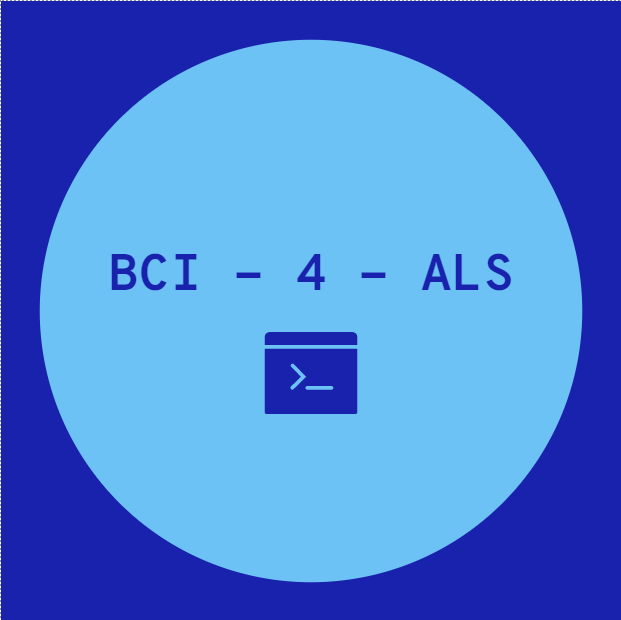
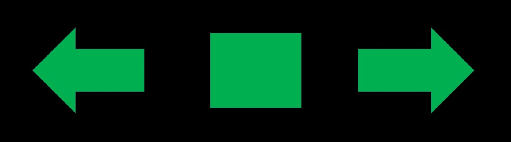

<!--
*** Thanks for checking out the Best-README-Template. If you have a suggestion
*** that would make this better, please fork the repo and create a pull request
*** or simply open an issue with the tag "enhancement".
*** Thanks again! Now go create something AMAZING! :D
-->


<!-- PROJECT SHIELDS -->
<!--
*** I'm using markdown "reference style" links for readability.
*** Reference links are enclosed in brackets [ ] instead of parentheses ( ).
*** See the bottom of this document for the declaration of the reference variables
*** for contributors-url, forks-url, etc. This is an optional, concise syntax you may use.
*** https://www.markdownguide.org/basic-syntax/#reference-style-links
-->
[![Contributors][contributors-shield]][contributors-url]
[![Forks][forks-shield]][forks-url]
[![Stargazers][stars-shield]][stars-url]
[![Issues][issues-shield]][issues-url]
[![MIT License][license-shield]][license-url]
[![LinkedIn][linkedin-shield]][linkedin-url]


<!-- PROJECT LOGO -->
<br />
<p align="center">
  <a href="https://github.com/evyatarluv/BCI-4-ALS">
    
  </a>

  <h3 align="center">BCI - 4 - ALS</h3>

  <p align="center">
    A complete EEG Motor Imagery Classification pipeline 
    <br />
    <a href="https://github.com/evyatarluv/BCI-4-ALS"><strong>Explore the docs »</strong></a>
    <br />
    <br />
    <a href="https://github.com/evyatarluv/BCI-4-ALS">View Demo</a>
    ·
    <a href="https://github.com/evyatarluv/BCI-4-ALS">Report Bug</a>
    ·
    <a href="https://github.com/evyatarluv/BCI-4-ALS">Request Feature</a>
  </p>
</p>


<!-- TABLE OF CONTENTS -->
<details open="open">
  <summary>Table of Contents</summary>
  <ol>
    <li>
      <a href="#about-the-project">About The Project</a>
      <ul>
        <li><a href="#built-with">Built With</a></li>
      </ul>
    </li>
    <li>
      <a href="#getting-started">Getting Started</a>
      <ul>
        <li><a href="#prerequisites">Prerequisites</a></li>
        <li><a href="#installation">Installation</a></li>
      </ul>
    </li>
    <li><a href="#usage">Usage</a></li>
    <li><a href="#roadmap">Roadmap</a></li>
    <li><a href="#contributing">Contributing</a></li>
    <li><a href="#license">License</a></li>
    <li><a href="#contact">Contact</a></li>
    <li><a href="#acknowledgements">Acknowledgements</a></li>
  </ol>
</details>


<!-- ABOUT THE PROJECT -->
## About The Project

[![Product Name Screen Shot][product-screenshot]](https://example.com)

BCI's measure brain activity, process it, and produce control signals that reflect
the user's intent. We aim to detect and classify patterns of activity in the
ongoing brain signals that are associated with specific tasks or events.

A common mental strategy is called motor imagery. In our implementation,
we aim to tell if the users are thinking of moving your left hand, right hand, or not moving (idle).




### Built With

* [psychopy](https://www.psychopy.org/)
* [MNE-features](https://mne.tools/mne-features)
* [Keras](https://keras.io/)
* [scikit-learn](https://scikit-learn.org/)


<!-- GETTING STARTED -->
## Getting Started

To get a local copy up and running follow these simple example steps.

### Prerequisites

* [LabRecorder](https://github.com/labstreaminglayer/App-LabRecorder)
* [OpenBCI GUI](https://openbci.com/index.php/downloads)
* [python modules](requirements.txt)


### Installation

1. Clone the repo
   ```sh
   git clone https://github.com/evyatarluv/BCI-4-ALS
   ```
2. Install python modules
   ```sh
   pip install -r requirements.txt
   ```


<!-- USAGE EXAMPLES -->
## Usage

Use this space to show useful examples of how a project can be used. Additional screenshots, code examples and demos work well in this space. You may also link to more resources.

For more examples, please refer to the [Jupyter Notebooks][notebooks-url]


<!-- ROADMAP -->
## Roadmap

See the [open issues](https://github.com/evyatarluv/BCI-4-ALS/issues) for a list of proposed features (and known issues).


<!-- CONTRIBUTING -->
## Contributing

Contributions are what make the open source community such an amazing place to be learn, inspire, and create. Any contributions you make are **greatly appreciated**.

1. Fork the Project
2. Create your Feature Branch (`git checkout -b feature/AmazingFeature`)
3. Commit your Changes (`git commit -m 'Add some AmazingFeature'`)
4. Push to the Branch (`git push origin feature/AmazingFeature`)
5. Open a Pull Request


<!-- LICENSE -->
## License

Distributed under the MIT License. See `LICENSE` for more information.


<!-- CONTACT -->
## Contact

Evyatar Luvaton - [luvaton@post.bgu.ac.il ](mailto:luvaton@post.bgu.ac.il )

Noam Siegel - [noamsi@post.bgu.ac.il](mailto:noamsi@post.bgu.ac.il)

Project Link: [https://github.com/evyatarluv/BCI-4-ALS](https://github.com/evyatarluv/BCI-4-ALS)


<!-- ACKNOWLEDGEMENTS -->
## Acknowledgements
* [Computational Psychiatry Lab @ BGU](https://www.computational-psychiatry.com/)
* [Lab Streaming Layer](https://github.com/sccn/labstreaminglayer)
* [MIT License](https://choosealicense.com/licenses/mit/)


<!-- MARKDOWN LINKS & IMAGES -->
<!-- https://www.markdownguide.org/basic-syntax/#reference-style-links -->
[contributors-shield]: https://img.shields.io/github/contributors/evyatarluv/BCI-4-ALS.svg?style=for-the-badge
[contributors-url]: https://github.com/evyatarluv/BCI-4-ALS/graphs/contributors
[forks-shield]: https://img.shields.io/github/forks/evyatarluv/BCI-4-ALS.svg?style=for-the-badge
[forks-url]: https://github.com/evyatarluv/BCI-4-ALS/network/members
[stars-shield]: https://img.shields.io/github/stars/evyatarluv/BCI-4-ALS.svg?style=for-the-badge
[stars-url]: https://github.com/evyatarluv/BCI-4-ALS/stargazers
[issues-shield]: https://img.shields.io/github/issues/evyatarluv/BCI-4-ALS.svg?style=for-the-badge
[issues-url]: https://github.com/evyatarluv/BCI-4-ALS/issues
[license-shield]: https://img.shields.io/github/license/evyatarluv/BCI-4-ALS.svg?style=for-the-badge
[license-url]: https://github.com/evyatarluv/BCI-4-ALS/blob/master/LICENSE.txt
[linkedin-shield]: https://img.shields.io/badge/-LinkedIn-black.svg?style=for-the-badge&logo=linkedin&colorB=555
[linkedin-url]: https://www.linkedin.com/in/evyatar-luvaton/
[product-screenshot]: images/screenshot.png
[docs-url]: https://github.com/evyatarluv/BCI-4-ALS
[notebooks-url]: notebooks

